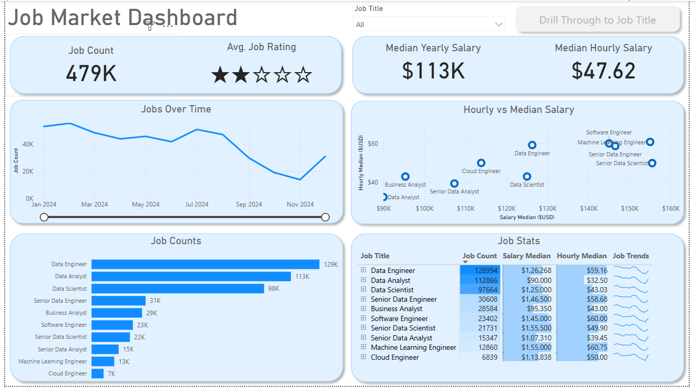
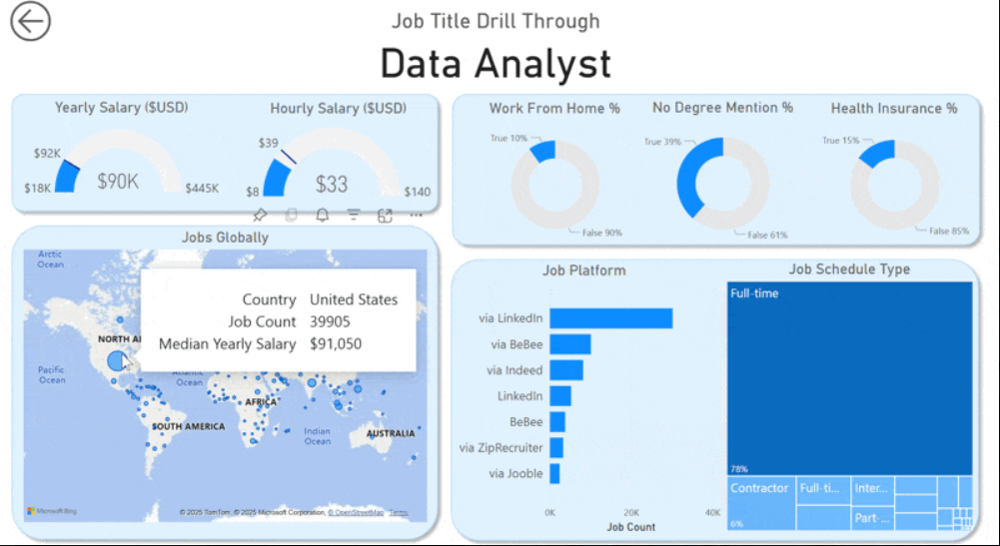

# Job Market Analytics Dashboard — Power BI

## Introduction

This dashboard was built for **Job Seekers, Job Transitioners, and Job Swappers** to solve a common problem: information about the data job market is scattered and hard to grasp. Using a real-world dataset of ~479K data science job postings (titles, salaries, locations, and platforms), this project provides a single, interactive interface to explore market trends and compensation.

### Dashboard File
You can find the file for the dashboard here: [`Data_Jobs_Dashboard.pbix`](Data_Jobs_Dashboard.pbix).

## Skills Showcased

This project was a journey through key Power BI features. Here's a look at what was covered:

- **⚙️ Data Transformation (ETL) with Power Query:** Cleaned, shaped, and prepared ~479K raw job records — handling blanks, changing data types, and creating new columns.
- **🧮 Measures:** Formulated measures to derive key KPIs like `Median Yearly Salary`, `Median Hourly Salary`, and `Job Count`.
- **📊 Core Charts:** Utilized **Line, Bar,** and **Scatter Charts** to compare job counts, salary distributions, and trends over time.
- **🔢 KPI Indicators, Gauges & Tables:** Used **Cards**, **Gauge charts**, and **Donut charts** to display key metrics, and **Tables** with sparklines for granular, sortable data.
- **🎨 Dashboard Design:** Designed an intuitive, KPI-first layout to tell a clear data story at a glance.
- **🖱️ Interactive Reporting:**
    - **Slicers:** To dynamically filter the report by Job Title.
    - **Drill-Through:** To navigate from a high-level summary to a contextual, job-specific detail view.
    - **Keep All Filters:** To preserve context when drilling through between pages.

---

## Dashboard Overview

*This report is split into two pages to provide both a high-level summary and a detailed, job-specific analysis.*

### Page 1: High-Level Market View

This is mission control for the data job market. It surfaces key KPIs — **479K job count**, **$113K median yearly salary**, **$47.62 median hourly salary**, and **average job rating** — alongside a jobs-over-time trend line, a salary scatter plot comparing hourly vs. yearly pay by role, and a sortable job stats table with per-title sparklines.

### Page 2: Job Title Drill Through

This is the deep-dive page. From the main dashboard, users can drill through on any job title (e.g., **Cloud Engineer**) to get specific details: yearly and hourly salary gauges, work-from-home percentage, degree requirement percentage, health insurance percentage, top hiring platforms, and job schedule type breakdown — all filtered to that single role.

---

## Conclusion

This dashboard shows how Power BI can transform raw job posting data into a powerful tool for career analysis. It lets users slice, filter, and drill through data — from a market-wide overview down to a single job title — to make informed decisions about their career paths.
